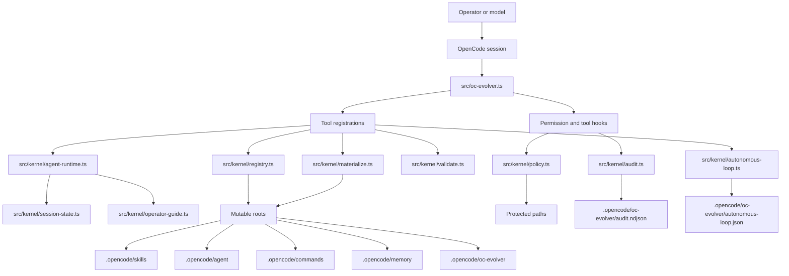
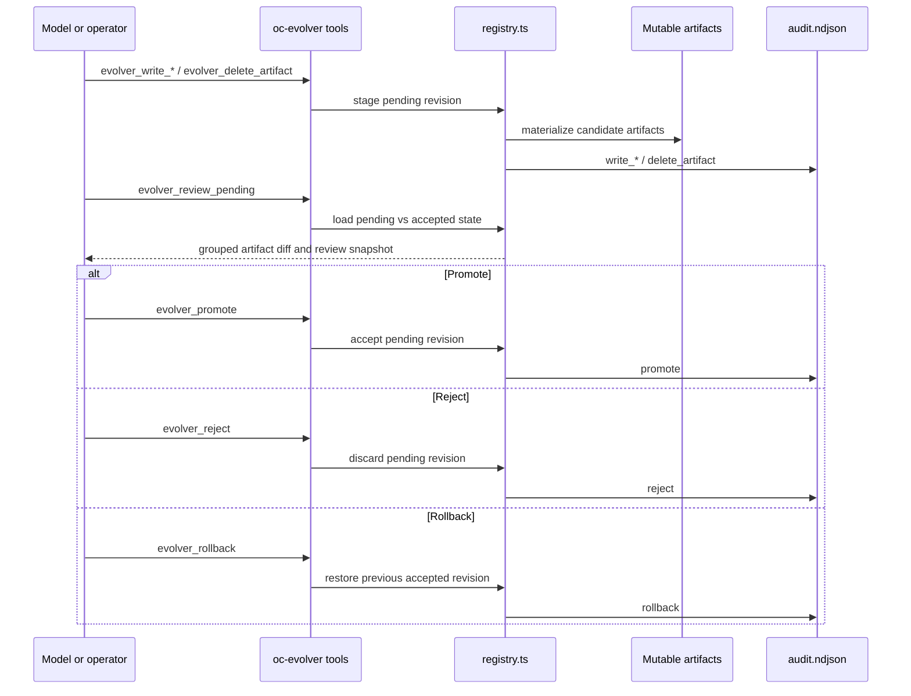
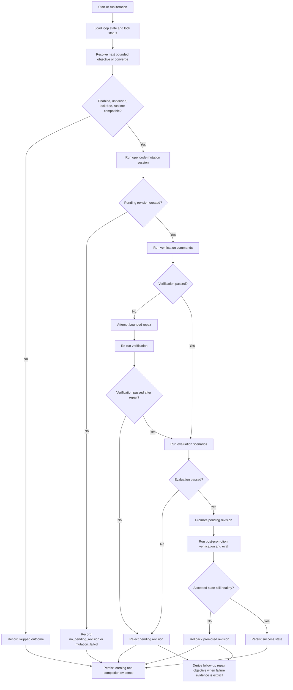
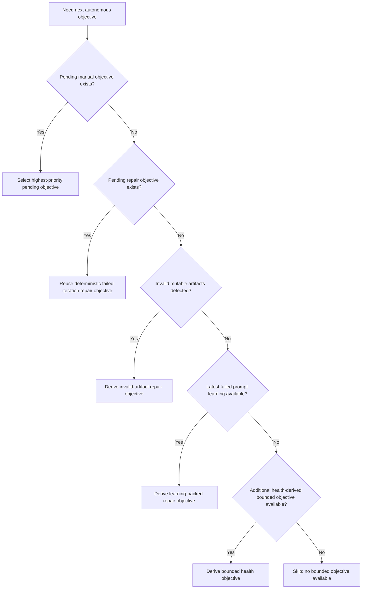

# oc-evolver

`oc-evolver` is an OpenCode plugin that exposes a stable kernel for evolving mutable OpenCode behavior without allowing the model to rewrite the kernel itself.

## Install

To load the plugin directly from a GitHub URL, put the git dependency spec directly in your OpenCode config:

```json
{
  "$schema": "https://opencode.ai/config.json",
  "plugin": ["git+https://github.com/<owner>/oc-evolver.git"]
}
```

OpenCode detects the package's `./server` export and installs it as a server plugin target.

Installed `./server` usage is intentionally global-only: mutable runtime state lives under `~/.config/opencode/oc-evolver/`, `~/.config/opencode/skills/`, `~/.config/opencode/agent/`, `~/.config/opencode/commands/`, and `~/.config/opencode/memory/`.

Eval fixtures still use workspace-local `.opencode/*` roots through explicit bridge files.

When the current workspace is the `oc-evolver` source repo itself, the plugin still uses the global OpenCode config root for mutable runtime state. Local development only relaxes protected-path checks so the kernel source can be edited in place.

## Operational model

- The kernel is fixed code.
- Only mutable runtime artifacts evolve: `skill`, `agent`, `command`, `memory`, and kernel state under the active OpenCode config root.
- Regular repo-local evals prove behavior through temp fixture workspaces.
- Installed-mode evals separately prove the published `./server` path through a temp global OpenCode config root.
- This repo documents and runs manual local verification gates rather than committing GitHub CI workflow runners.

## Layout

- Kernel plugin entry: `src/oc-evolver.ts`
- Kernel support code: `src/kernel/*.ts`
- Frozen local runtime contract: `eval/runtime-contract.json`
- Fixture bridge plugin: `eval/fixtures/base/.opencode/plugins/oc-evolver.ts`
- Eval runner: `scripts/run-eval.ts`
- Scenario prompts: `eval/scenarios/*.md`
- Captured eval artifacts: `eval/results/<scenario>/<timestamp>/`

## Mutable roots

The kernel only allows autonomous writes inside these roots relative to the active OpenCode config root:

- `.opencode/oc-evolver/`
- `.opencode/skills/`
- `.opencode/agent/`
- `.opencode/commands/`
- `.opencode/memory/`

The local runtime contract is currently frozen to OpenCode `1.14.31` with native agent directory `agent/`.

## Protected paths

The kernel blocks autonomous edits to protected paths, including:

- `.opencode/plugins/**`
- `.opencode/opencode.json`
- `.opencode/opencode.jsonc`
- `.opencode/package.json`
- lockfiles

Protected-path denial is enforced both through `permission.ask` and through `tool.execute.before` for mutating filesystem tools such as `write`, `edit`, `patch`, and `apply_patch`, so the plugin still blocks kernel edits during eval runs that use `--dangerously-skip-permissions`.

When the current workspace is the `oc-evolver` source repo itself, the plugin relaxes that self-protection so the agent can edit `src/oc-evolver.ts` and the rest of the kernel during local development. Installed/runtime usage keeps the normal protections.

## Kernel tools

The plugin exposes this stable v1 tool surface:

- `evolver_status`
- `evolver_check`
- `evolver_review_pending`
- `evolver_validate`
- `evolver_write_skill`
- `evolver_write_agent`
- `evolver_write_command`
- `evolver_write_memory`
- `evolver_apply_skill`
- `evolver_apply_memory`
- `evolver_autonomous_status`
- `evolver_autonomous_configure`
- `evolver_autonomous_start`
- `evolver_autonomous_pause`
- `evolver_autonomous_resume`
- `evolver_autonomous_run`
- `evolver_autonomous_stop`
- `evolver_autonomous_metrics`
- `evolver_autonomous_preview`
- `evolver_run_agent`
- `evolver_run_command`
- `evolver_delete_artifact`
- `evolver_prune`
- `evolver_promote`
- `evolver_reject`
- `evolver_rollback`

Mutable writes now land as pending revisions. In the interactive/operator flow, use `evolver_check` to see whether the registry is clean and whether a pending revision is still awaiting review, then use `evolver_promote` or `evolver_reject` to explicitly accept or discard that pending state.

Use `evolver_review_pending` when you need the actual pending-vs-current revision contents and a grouped artifact-change summary before promoting or rejecting a staged revision.

The autonomous loop now has plugin-native control-plane tools. `evolver_autonomous_configure` persists objectives, verification commands, eval scenarios, schedule state, and a failure policy under the active OpenCode config root's `oc-evolver/autonomous-loop.json` (for example `.opencode/oc-evolver/autonomous-loop.json` in repo-backed/eval fixtures). Today the loop stays intentionally bounded rather than free-form: it selects the highest-priority pending objective from the persisted queue, preserves deterministic repair objectives from failed ad-hoc or queued iterations, and when the queue is otherwise empty it can synthesize bounded objectives from durable evidence such as invalid mutable artifacts, repeated failed verification or evaluation evidence, and other recent repeated loop health signals. When no bounded objective is available, preview and runtime both converge on a deterministic skip instead of launching an open-ended improvement prompt. Objectives can also declare their own `completionCriteria.verificationCommands` when a specific gate must pass before that objective can be marked complete. The failure policy tracks consecutive objective failures and can either auto-pause the loop or quarantine the repeatedly failing objective after the configured threshold. `pause_loop` leaves `config.paused=true`, and subsequent runs surface `skipped_paused` until `evolver_autonomous_resume` clears that state. `quarantine_objective` changes the objective status to `quarantined`, which removes it from normal objective selection while leaving its escalation reason visible in status. `evolver_autonomous_start`, `evolver_autonomous_pause`, `evolver_autonomous_resume`, and `evolver_autonomous_stop` manage scheduled execution, `evolver_autonomous_run` executes one iteration immediately, `evolver_autonomous_preview` reports whether the next iteration would run plus the selected objective/prompt, source, rationale, and merged verification/eval gates, `evolver_autonomous_metrics` summarizes loop history, and `evolver_autonomous_status` reports the queue, latest learning, the most recent escalation reason, and recent iteration artifacts.

For a closed-loop path, `bun run autonomous:run` drives `opencode run` against the real repo, reuses the last continued session, persists richer loop learning plus iteration history under `.opencode/oc-evolver/autonomous-loop.json`, runs the default verification gates (`bun run typecheck`, `bun run test:unit`), runs the dedicated `autonomous-run` eval by default, and then auto-promotes, auto-rejects, or rolls back a newly accepted revision if post-promotion health regresses. Scheduled runs now use both a worker-local in-flight guard and a durable lock at `.opencode/oc-evolver/autonomous-loop.lock`. That lock now records acquisition metadata and will only be reclaimed automatically when the metadata proves the lock has gone stale; otherwise the next run still returns `skipped_locked`. Pass `--worker` to keep that loop on a Worker-backed 15-minute schedule by default, or override the cadence with `--interval-ms <ms>`.

Commands are executable runtime artifacts rather than write-only markdown. `evolver_run_agent` and `evolver_run_command` now return structured execution records with the composed session response instead of only acknowledging that they ran. Commands can carry their own `memory`, `permission`, and `model` metadata, and after a successful command run `evolver_run_command` composes those command-owned settings with any referenced agent instructions before persisting the resulting runtime policy and merged command memory state for the continued session.

Lifecycle cleanup is also plugin-native: `evolver_delete_artifact` stages a deletion into a pending revision and removes the artifact from the working registry state, while `evolver_prune` removes obsolete revision snapshots that are no longer reachable from the accepted or pending revision graph.

Memory profiles are versioned markdown artifacts stored under `.opencode/memory/`. They steer session behavior by injecting Basic Memory routing guidance, optional `storage_mode`, and reusable source/query hints into skill and agent composition without copying the underlying Basic Memory note corpus into the kernel registry.

If a session applies a memory profile with `storage_mode: artifact-only`, the plugin denies Basic Memory mutation tools for that session through `tool.execute.before`.

## Architecture

The README uses Mermaid as the canonical diagram format for the plugin architecture and evolution loop. The diagrams below describe the current implementation first, and call out planned self-directed behavior explicitly when it does not exist yet.

### Plugin architecture



`src/oc-evolver.ts` is the kernel entrypoint. It exposes the stable tool surface, restores persisted control-plane state, and routes operations into the kernel modules. `registry.ts`, `materialize.ts`, and `validate.ts` own artifact durability and revision semantics. `policy.ts` enforces the mutable-root boundary, while `audit.ts` records durable evidence for operator review and eval assertions. The autonomous loop and runtime composition stay inside that same kernel boundary instead of letting the model rewrite the plugin itself.

### Revision lifecycle



Mutable artifacts are never edited in place without revision context. The registry is the authority for `pendingRevision`, `currentRevision`, accepted history, prune eligibility, and rollback safety. That design keeps operator review explicit even when the model is the one proposing the artifact change.

### Autonomous iteration



The loop is designed to stay bounded and auditable. It records verification and evaluation evidence, keeps repair attempts limited, and only auto-queues a follow-up objective when the evidence is concrete enough to restate as an explicit artifact-and-gate objective. Promotion is not the terminal success condition by itself; post-promotion health still has to hold or the loop rolls the accepted state back.

### Objective sourcing



Current behavior is fully bounded and evidence-backed: queued manual objectives first, then pending repair objectives from failed iterations, then invalid-artifact repairs, then learning-backed repairs from the latest failed prompt, then additional health-derived objectives from repeated recent bounded evidence, and finally a deterministic `no bounded objective available` skip when nothing concrete remains. The intent is to make the loop more self-directed without making it speculative: proposed objectives come from durable evidence such as invalid mutable artifacts, persisted loop failures, or other bounded registry-health signals, not from unconstrained brainstorming.

## Local commands

- Install dependencies: `bun install`
- Typecheck: `bun run typecheck`
- Unit tests: `bun run test:unit`
- Runtime contract check: `bun run scripts/check-runtime-contract.ts`
- Autonomous loop: `bun run autonomous:run`
- Core eval tier: `bun run eval:core`
- Regular eval tier: `bun run eval:pr`
- Autonomous eval: `bun run eval:autonomous-run`
- Smoke eval: `bun run eval:smoke`
- Full eval suite: `bun run eval:all`
- Installed smoke evals: `bun run eval:installed-smoke`
- Installed autonomous eval: `bun run eval:installed-autonomous`

The release checklist lives in `docs/release.md`.

## Evaluation model

- `scripts/run-eval.ts` runs the regular eval tiers against a fresh temp workspace cloned from `eval/fixtures/base/`.
- `scripts/run-installed-eval.ts` runs installed-mode proofs against a temp `HOME` / global OpenCode config root so the published `./server` entrypoint is exercised the way operators actually install it.
- Neither harness targets the real user config tree.

Each scenario writes artifacts under `eval/results/<scenario>/<timestamp>/`, including:

- `result.json`
- `response.json`
- `stdout.txt`
- `stderr.txt`
- `turns.json` for multi-turn scenarios
- `audit.ndjson`
- `registry.json`

See `docs/evaluation.md` for scenario expectations and the latest pass matrix.
